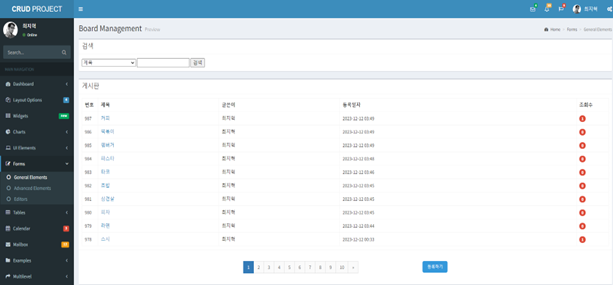
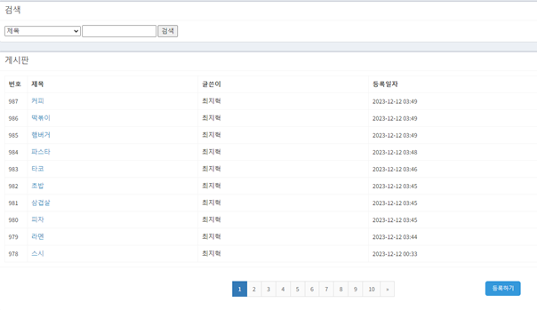
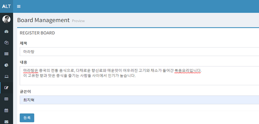
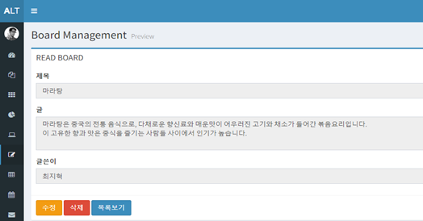
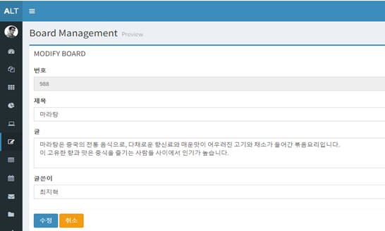

# 📑 Spring MVC CRUD Board

본 프로젝트는 **Spring Framework**를 활용하여 구현한 MVC 아키텍처 기반 CRUD 게시판입니다.  
회원이 게시글을 작성, 조회, 수정, 삭제할 수 있으며, 검색과 페이징 기능을 지원합니다.

📂 GitHub Repo: [CRUDBoard-Spring](https://github.com/choiji12/CRUDBoard-Spring)

 

## 📖 프로젝트 개요
- **주제 선정 이유**: 웹 애플리케이션 개발 역량 강화를 위해 전형적인 CRUD 기능을 가진 게시판 시스템을 직접 구현하고자 함  
- **목표**: Spring MVC 기반으로 게시글 등록, 조회, 수정, 삭제와 검색·페이징 기능을 지원하는 CRUD 게시판 구축  
- **환경**: Spring, MySQL, Tomcat, BootStrap

 

## 📋 주요 기능
- **게시판 관리**
  - 게시글 등록(Create)
  - 게시글 조회(Read)
  - 게시글 수정(Update)
  - 게시글 삭제(Delete)

- **검색 및 페이징**
  - 키워드 기반 검색 기능
  - 다중 조건 검색 지원 (제목, 내용, 작성자)
  - 페이지네이션 처리 (MyBatis 동적 쿼리 활용)

- **UI/UX**
  - BootStrap 기반 UI
  - 직관적인 사용자 인터페이스 제공
  - 게시글 목록, 검색, 상세조회 페이지 구성

 

## 📸 실행 화면
- 게시판 메인 페이지  

- 검색 페이지  

- 작성 페이지  

- 조회 페이지  

- 수정 페이지  

 

## 💡 학습 및 느낀 점
- Spring Framework의 **의존성 주입(DI)**과 **관점 지향 프로그래밍(AOP)**을 통해 생산성을 높이고 유지보수를 쉽게 할 수 있음을 경험  
- MVC 패턴을 활용하여 **Controller-Service-DAO** 구조의 데이터 흐름과 요청/응답 과정 이해  
- **MyBatis 동적 SQL 템플릿**을 이용해 검색/페이징 기능 구현, SQL 관리의 편의성과 재사용성 체감  
- 디버깅 및 JUnit 테스트를 통해 백엔드 로직 검증 및 예외 처리 경험 축적  
- JSP를 통한 프론트엔드 개발 경험을 통해 백엔드-프론트 간 데이터 전달과 UI 반영 과정을 이해  

 

## 🛠️ 사용 기술
- **Framework**: Spring MVC, MyBatis  
- **Frontend**: JSP, BootStrap  
- **Backend**: Spring, Tomcat  
- **Database**: MySQL  
- **IDE**: Spring Tool Suite (STS)  
- **Test & Debugging**: JUnit  

 
